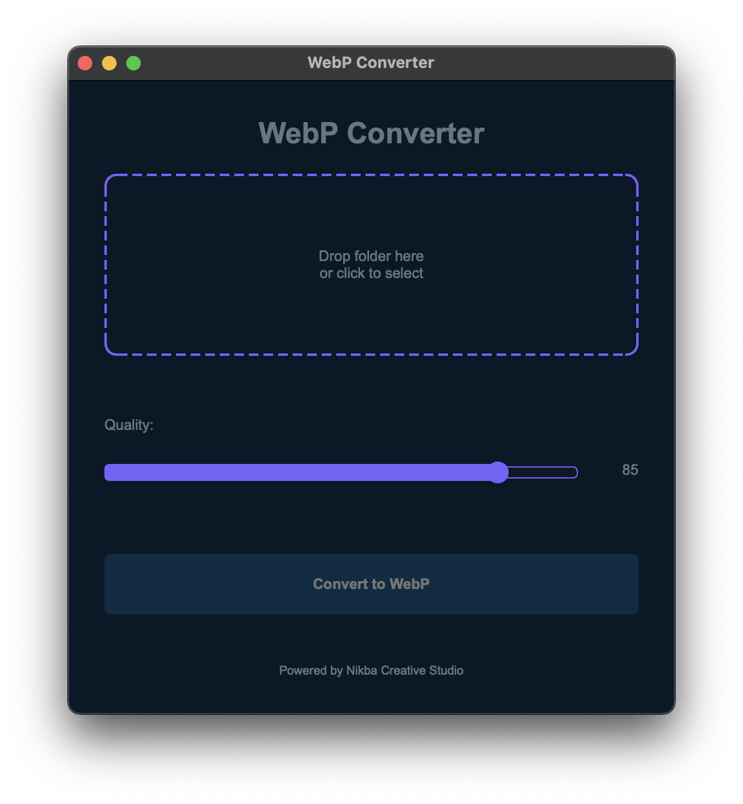

# WebP Converter

A modern Python application for converting images to WebP format with a sleek dark-themed UI.



## Features

- Drag and drop folder selection
- Quality control slider (1-100)
- Progress tracking
- Support for multiple image formats (PNG, JPG, JPEG, TIFF, BMP)
- Dark theme UI
- Error handling and status updates

## Download

You can download the latest release from the [Releases](https://github.com/yourusername/webp-converter/releases) page.

## Building the Application

### Prerequisites

1. Python 3.8 or higher
2. pip (Python package installer)

### Installation

1. Clone this repository:
```bash
git clone <repository-url>
cd webp-converter
```

2. Install the required dependencies:
```bash
pip install -r requirements.txt
```

### Building the Distribution

1. Run the build script:
```bash
python build.py
```

2. The distribution will be created in the `dist` folder:
   - On macOS: `dist/WebP Converter.app`
   - On Windows: `dist/WebP Converter/WebP Converter.exe`

### Running the Application

- **macOS**: Double-click the `WebP Converter.app` in the `dist` folder or move it to your Applications folder
- **Windows**: Run `WebP Converter.exe` from the `dist/WebP Converter` folder

## Usage

1. Launch the application
2. Either drag and drop a folder containing images or click to select a folder
3. Adjust the quality using the slider (default is 85)
4. Click "Convert to WebP" to start the conversion
5. Monitor the progress in the progress bar
6. The converted WebP images will be saved in the same folder as the original images

## License

This project is licensed under the MIT License - see the LICENSE file for details. 